```puml
    @startuml
    class A
    @enduml
```

## 安装插件
//保证格式正确："插件名": "^版本号",
1. 方式一通过package.json 新增插件库
//保证格式正确："插件名": "^版本号",

```
"hexo-filter-plantuml": "^1.0.1",
"hexo-filter-sequence": "^1.0.3",
"hexo-tag-plantuml": "^1.0.0",
"hexo-pdf": "^1.1.1"
```
> 如何插件版本号：可以在插件的github库文件`package.json`中得到。

执行安装：
```
sudo npm install
```
2. 方式二: 安装单个插件
即下文的作图插件说明中使用的安装方式

## 举例：作图插件
1. flowchart流程图
2. sequence队列图
3. plantuml类图
### [plantuml](http://plantuml.com/use-case-diagram)
[hexo-filter-plantuml](https://github.com/wafer-li/hexo-filter-plantuml)
安装：
```js
npm install --save hexo-filter-plantuml
```
hexo使用语法：

    

效果图：

### hexo-filter-sequence
[sequence](https://github.com/bubkoo/hexo-filter-sequence)

安装：
```
npm install --save hexo-filter-sequence
```
配置
_config.yml:
```
sequence:
# webfont:     # optional, the source url of webfontloader.js
# snap:        # optional, the source url of snap.svg.js
# underscore:  # optional, the source url of underscore.js
# sequence:    # optional, the source url of sequence-diagram.js
# css: # optional, the url for css, such as hand drawn theme
options:
theme:
css_class:
```
hexo使用语法：
```sequence
    Alice->Bob: Hello Bob, how are you?
    Note right of Bob: Bob thinks
    Bob-->Alice: I am good thanks!
```
        
```sequence
Alice->Bob: Hello Bob, how are you?
Note right of Bob: Bob thinks
Bob-->Alice: I am good thanks!
```
效果图：

[hexo-filter-flowchart](https://github.com/bubkoo/hexo-filter-flowchart)
安装：
```
npm install --save hexo-filter-flowchart
```
hexo使用语法：
```flow
st=>start: Start|past:>http://www.google.com[blank]
e=>end: End:>http://www.google.com
op1=>operation: My Operation|past
op2=>operation: Stuff|current
sub1=>subroutine: My Subroutine|invalid
cond=>condition: Yes
or No?|approved:>http://www.google.com
c2=>condition: Good idea|rejected
io=>inputoutput: catch something...|request

st->op1(right)->cond
cond(yes, right)->c2
cond(no)->sub1(left)->op1
c2(yes)->io->e
c2(no)->op2->e
```
    
效果图：
```flow
st=>start: Start|past:>http://www.google.com[blank]
e=>end: End:>http://www.google.com
op1=>operation: My Operation|past
op2=>operation: Stuff|current
sub1=>subroutine: My Subroutine|invalid
cond=>condition: Yes
or No?|approved:>http://www.google.com
c2=>condition: Good idea|rejected
io=>inputoutput: catch something...|request

st->op1(right)->cond
cond(yes, right)->c2
cond(no)->sub1(left)->op1
c2(yes)->io->e
c2(no)->op2->e
```

### 插件hexo-pdf
安装：
```
npm install --save hexo-pdf
```

hexo使用语法：
1. 普通 PDF
```

```
2. 相对路径
```

```
3. 支持Google盘/Slideshare
```

```
Slideshare
```

```
预览：


"hexo-tag-plantuml"


