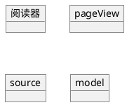

运行scheme： `PDFReaderForOSX` 即可



## 支持iOS

pageViewController: pdf翻页效果视图控制器
startingViewController:DataViewController,翻页视图控制器的视图源
modelController:ModelController:NSObject,数据视图数据源的model模型。

```puml
@startuml
object 阅读器
object pageView
object source
object model
@enduml
```
