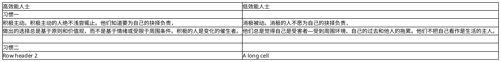

## 七个习惯概论


| 高效能人士 | 低效能人士 |
|-------|-------|
|**习惯一：积极主动**||
|<b>积极主动</b><br>积极主动的人绝不浅尝辄止。他们知道要为自己的抉择负责，做出的选择总是基于原则和价值观，而不是基于情绪或受限于周围条件。积极的人是变化的催生者。|<b>消极被动</b><br>消极的人不愿为自己的抉择负责，他们总是觉得自己是受害者—受到周围环境、自己的过去和他人的拖累。他们不把自己看作是生活的主人。 |
|**习惯二：以终为始**||
|**以终为始（先定目标后有行动）**<br>个人、家庭、团队、组织通过创造性的构思来设计自己的未来，他们对于任何项目，无论大小，也不管是个人的还是团队的，都下决心完成。他们标识并献身于自己生活中最重要的原则、人际关系和目标。|**不定目标就行动**<br>他们缺乏个人愿景，没有目标。他们不思考生活的意义，也不愿制定使命宣言。他们的生活总是遵循社会流行的、而不是自己选择的价值观。|
|**习惯三：要事第一**||
|**要事第一** <br>以要事为先的人总是按照事务重要性的顺序来安排生活并付诸实践。无论情势如何，他们的生活总是遵循自己最珍视的原则。|**不重要的事先做**<br>他们总是在应付各种危机。他们之所以无法关注最重要的事务，是因为他们总是纠缠于周围环境、过去的事情或人间是非。他们陷入成堆的琐事，被紧迫的事务弄得团团转。|
|**习惯四：双赢思维**||
|**双赢思维**<br>有双赢思维的人能在交往中寻求双方获利、互相尊重。他们基于到处是机遇和富足的心态，基于“我们”而不是“我”，来进行思考。他们总是通过向感情账户存款来建立与他人的互信关系。|**非赢即输**<br>他们抱的是匮乏心态，把生活看作是一场零和游戏。他们不善与他人沟通，总是从感情账户提款，结果是时时提防他人，陷入对抗的心理。|
|**习惯五：知彼解己**||
|**知彼解己（先理解别人，再争取别人的理解）** <br>当我们怀着理解对方的想法，而不是为了回答对方的问题去聆听时，我们就能进行真正的沟通并建立友谊。这时再坦述己见、争取理解就很自然，也容易多了。理解别人需要的是体谅，而争取别人理解需要的是勇气。效能在于这二者的平衡或适当的结合。|**先寻求别人的理解** <br>他们并未理解对方就先讲述自己的观点，完全基于自己的经验或动机。他们不先对问题做出诊断就盲目开出处方。|
|**习惯六：统合综效**||
|**统合综效**<br>统合综效的人与对方合作，寻求第三变通方案。不是我的，也不是你的，而是第三种更好的解决方案。统合综效的基础是尊重、赞赏甚至庆贺彼此间的差异。它是某种创造性的合作，1＋1＝3，11，111，或者更多。|**妥协、争斗或逃避** <br>低效能人士相信总体小于部分之和。他们试图在自己的形象中克隆他人。他们把自己与他人的差异看作威胁。|
|**习惯七：不断更新**||
|**不断更新（磨刀不误砍柴工）** <br>高效能人士不断在生活的四个方面（身体、社会／情感、智力、精神）更新自己。这将增加他们实践其他有效习惯的能力。|**把自己累得筋疲力尽**<br>低效能人士没有自我更新、自我改善的规划，最终失去了过去所拥有的锋利刀刃（竞争力）。|
### 1）在七个习惯上给自己评分
这个评估能帮你了解自己在实践七个习惯方面的现状。为了了解自己的进步，你可以在读完本书后重新进行一次评估。
仔细阅读下列表格中的每句话，利用自己的最佳判断，圈出标识自己在每个习惯方面做得如何的数字（1表示极差，而6表示杰出）。

|七个习惯上的评分|
|:----------:|

|感情账户||
|:-----------|:---|
|1. 待人和蔼，体谅对方<br>2.我信守诺言<br>3. 我不在别人背后说他坏话。 |评分：<br><br>评分：<br><br>评分：|
|产出/产能平衡||
|4. 我能在生活的各个方面（家庭、朋友、工作等）保持适当的平衡<br>5.当我致力于某个项目时，总是想着业主的需求和厉害关系。<br>6. 我努力工作，但绝不把自己累的精疲力尽。 |评分：<br><br>评分：<br><br>评分：|
|**习惯一：积极主动**||
|7. 我能掌控自己的生活<br>8. 我把关注集中于我能有所作为的事情上，而不是集中在我无法控制的事件上。<br>9. 我敢于为自己的情绪负责，而不是埋怨环境、责备他人。 |评分：<br><br>评分：<br><br>评分：|
|**习惯二：以终为始**||
|10. 我明白自己在生活中的追求什么。<br>11. 我的生活和工作井然有序，很少陷入危急态势。<br>12.我每周都有一个清晰的计划，注明我想完成的事情 |评分：<br><br>评分：<br><br>评分：|
|**习惯三：要事第一**||
|13.我致力于完成自己的计划（避免延误、浪费时间等等）。<br>14. 我不让日常琐事埋没了真正重要的事务。<br>15. 我每天做的事情都是有意义的，有助于实现我的生活目标。 |评分：<br><br>评分：<br><br>评分：|
|**习惯四：双赢思维**||
|16. 我关心别人的成功，就像关心自己的成功一样。<br>17. 我能与别人合作。<br>18. 遇到矛盾时，我努力寻求有利于各方的解决方案。 |评分：<br><br>评分：<br><br>评分：|
|**习惯五：知彼知己**||
|19. 我对他人的感觉也很敏感。<br>20. 我尽力理解对方的观点。<br>21. 倾听时，我试图从对方的角度，而不仅从自己的角度来观察问题。 |评分：<br><br>评分：<br><br>评分：|
|**习惯六：统合综效**||
|22. 我赞赏并力图了解他人的见解。<br>23. 我竭力寻求新的、更好的想法和解决方案。<br>24. 我鼓励他人表达他们的观点 |评分：<br><br>评分：<br><br>评分：|
|**习惯七：不断更新**||
|25.我真系自己的身体和健康。<br>26.我努力建立并改善与他人的关系。<br>27. 我肯花时间追求生活的意义和乐趣。 |评分：<br><br>评分：<br><br>评分：|

### 你的习惯
`习惯`是知识、技巧和意愿的交叉点。
`知识`是做什么和为何做，`技巧`是如何做，而`意愿`是动力——想做。所有这三者必须集合在一起才能形成一个习惯。
请列出你的两个习惯，一个好习惯，一个坏习惯。并写出关联于这两个习惯的知识、技巧和意愿。
```


```
习惯有巨大的引力——比大多数人认识到的或愿意承认的还要大。打破一个根深蒂固的习惯需要做出极大的努力，而且一般还会涉及生活的重大变化。
看看你写下的坏习惯。你愿意为了打破这个坏习惯做出一切必要的努力吗？若是，请写下三件为了打破这个习惯你将着手做的事情。请记录下你的进步过程。
```
1．
2．
3．
```
看一下图2-2七个习惯模型，你位于何处？花几分钟记录下你的现状及其原因。你的什么行为和态度让你处于目前这种状况？你开始看到自己最需要在哪方面做出努力了吗？
```


```


